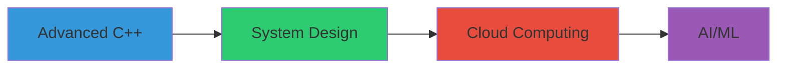

# <div align="center">👨‍💻 Naila Shehzadi</div>

<div align="center">
  
</div>

<div align="center">
  
</div>

## 🎯 About Me

```javascript
const naila = {
    role: "Computer Engineering Student",
    code: ["C++", "Python", "JavaScript", "Java"],
    technologies: {
        frontEnd: {
            js: ["React", "Next.js"],
            css: ["Tailwind", "Bootstrap"]
        },
        backEnd: {
            python: ["Django", "Flask"],
            js: ["Node.js", "Express"]
        },
        databases: ["MongoDB", "MySQL", "PostgreSQL"],
        tools: ["Git", "Docker", "VS Code", "Postman"]
    },
    currentFocus: "Building Scalable Web Applications"
};
```

## 🚀 Expertise

<div align="center">

| Category | Technologies |
|----------|-------------|
| Languages |    |
| Frontend |    |
| Backend |   |
| Database |   |
| Tools |   |

</div>

## 📊 GitHub Statistics

<div align="center">
  
</div>

<div align="center">
  
</div>

<div align="center">
  
</div>

## 🎓 Education

- **Bachelor of Computer Engineering**
  - Specialization in Software Systems
  - Focus on Full Stack Development
  - Data Structures & Algorithms

## 🌱 Current Learning Path



## 💼 Professional Goals

- 🎯 Full Stack Development
- 🔧 Software Architecture
- 🤖 Machine Learning
- 🌐 Cloud Computing
- 📱 Mobile Development

## 🏆 Achievements

- 🥇 Competitive Programming Participant
- 💻 Open Source Contributor
- 📚 Technical Blog Writer
- 🎓 Academic Excellence

## 🤝 Let's Connect!

<div align="center">
  
[](https://www.linkedin.com/in/naila-shehzadi-10g/)
[](https://github.com/Nailashehzadi01)
[](mailto:Nailashehzadi396@gmail.com)
[](https://your-portfolio-url.com)

</div>

## 📈 Contribution Graph

<div align="center">
  
</div>

---

<div align="center">
  
</div>

<div align="center">
  <b>🚀 "Code is like humor. When you have to explain it, it's bad." 💭</b>
</div>

---
<div align="center">
  
</div> 
