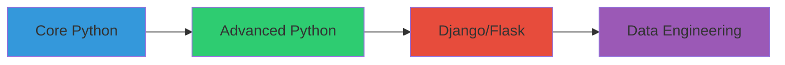

# <div align="center">👨‍💻 Naila Shehzadi</div>

<div align="center">
  
</div>

<div align="center">
  
</div>

## 🎯 About Me

```python
naila = {
    "role": "Junior Python Developer",
    "education": "Computer Engineering Student",
    "code": ["Python", "C++", "SQL"],
    "technologies": {
        "backend": ["Django", "Flask", "FastAPI"],
        "database": ["PostgreSQL", "MySQL", "SQLite"],
        "tools": ["Git", "VS Code", "PyCharm"],
        "testing": ["pytest", "unittest"]
    },
    "current_focus": "Building Robust Python Applications"
}
```

## 🚀 Expertise

<div align="center">

| Category | Technologies |
|----------|-------------|
| Primary |  |
| Secondary |  |
| Backend |   |
| Database |   |
| Tools |   |

</div>

## 📊 GitHub Statistics

<div align="center">
  
</div>

<div align="center">
  
</div>

<div align="center">
  
</div>

## 🎓 Education

- **Bachelor of Computer Engineering**
  - Focus on Python Development
  - Data Structures & Algorithms
  - Database Management Systems

## 🌱 Current Learning Path



## 💼 Professional Goals

- 🐍 Advanced Python Development
- 🔧 Backend Architecture
- 📊 Data Engineering
- 🔒 Security Best Practices
- 🧪 Test-Driven Development

## 🏆 Achievements

- 🥇 Python Programming Certifications
- 💻 Backend Development Projects
- 📚 Technical Documentation Contributor
- 🎓 Academic Excellence

## 🤝 Let's Connect!

<div align="center">
  
[](https://www.linkedin.com/in/naila-shehzadi-10g/)
[](https://github.com/Nailashehzadi01)
[](mailto:nailashehzadi396@gmail.com)

</div>

## 📈 Contribution Graph

<div align="center">
  
</div>

---

<div align="center">
  
</div>

<div align="center">
  <b>🐍 "Python is not just a language, it's a way of thinking." 💭</b>
</div>

---
<div align="center">
  
</div> 
